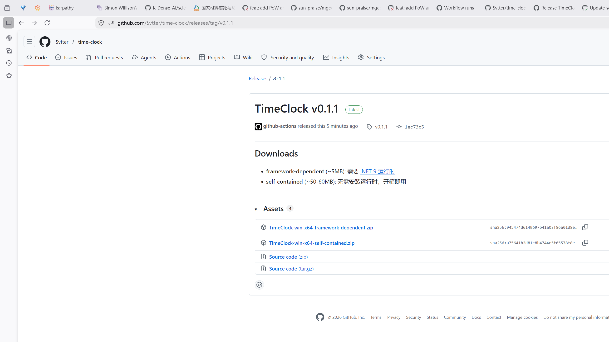

# FileManager

本地文件管理器，基于 WinForms (.NET 8)。

轻量、快速、无依赖，打开即用。



## 特性

- **快速启动** — 纯 .NET 8 WinForms，冷启动秒开，内存占用极低
- **目录树导航** — 左侧树形结构浏览，按需加载子目录
- **文件列表** — 名称/大小/类型/修改日期，支持排序
- **图片预览** — 支持 JPG, PNG, BMP, GIF, WebP, TIFF
- **PDF 预览** — 内置 WebView2 渲染，无需外部程序
- **右键菜单** — 打开、复制、剪切、复制路径、重命名、删除（回收站）、属性
- **导航** — 后退/前进/上级/地址栏输入
- **系统图标** — 通过 Shell32 API 获取真实文件图标
- **任务栏固定** — 自动注册 AppUserModelID，支持固定到任务栏和开始菜单

## 构建

```bash
dotnet build
```

## 运行

```bash
dotnet run
```

## 技术栈

- .NET 8 WinForms
- WebView2 (PDF 预览)
- Shell32 API (系统文件图标)

## License

[Apache License 2.0](LICENSE)
